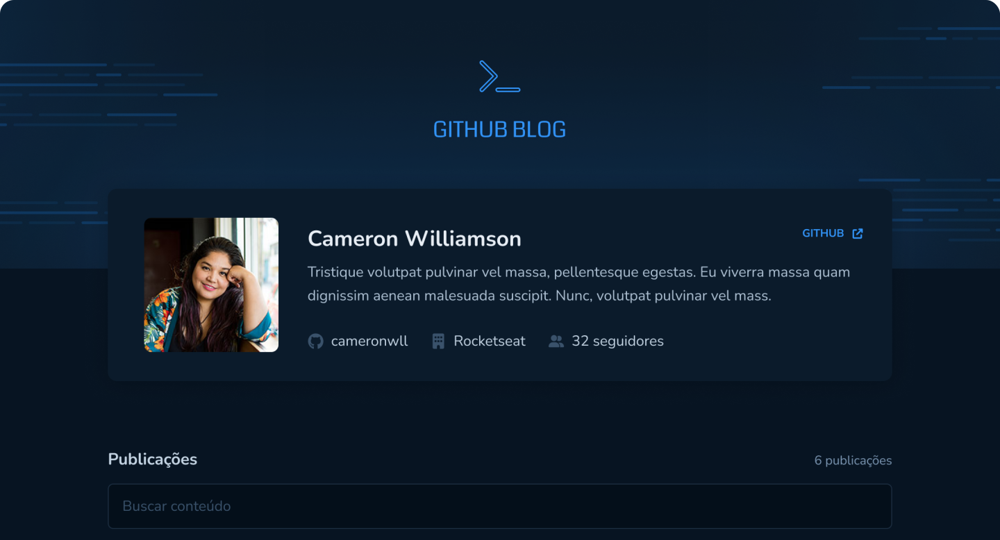

<h4 align="center">

</h4>

<h4 align="center">
    <p align="center">
      <a href="#-about">About</a>&nbsp;&nbsp;&nbsp;|&nbsp;&nbsp;&nbsp;
      <a href="#-technologies">Technologies</a>&nbsp;&nbsp;&nbsp;|&nbsp;&nbsp;&nbsp;
      <a href="#-how-to-run-the-project">Run</a>&nbsp;&nbsp;&nbsp;|&nbsp;&nbsp;&nbsp;
      <a href="#-info">Info</a>&nbsp;&nbsp;&nbsp;|&nbsp;&nbsp;&nbsp;
      <a href="#-license">License</a>
  </p>
</h4>

<h1 align="center">
  
</h1>

## 🔖 About

O **Github Blog** é o terceiro desafio que tem como consumir a API do github para exibir issues.

Com esse projeto é possível:

- Consumir a API
- Listar todas as issues
- Exibir uma issue específica
- Formatar o conteúdo da issue em markdown

O layout está disponível no [Figma](https://www.figma.com/community/file/1138814493269096792)

## 🚀 Technologies

- [ReactJS](https://reactjs.org/)
- [TypeScript](https://www.typescriptlang.org/)
- [Vitejs](https://vitejs.dev/)
- [FontAwesome](https://phosphoricons.com/)
- [StyledComponents](https://styled-components.com/)
- [Zod](https://zod.dev/)

## 🏁 How to run the project

```bash
# Clone the repository
git clone https://github.com/rafinhaa/github-blog.git
cd github-blog

# Install the dependencies
npm install

# Copy dotenv file
cp .env.example .env

# Edit dotenv file
vi .env.example .env

# Start the application
npm run dev
```

## ℹ️ Info

[Detalhes](docs/ABOUT.md)

## 📝 License

[MIT](LICENSE)

**Free Software, Hell Yeah!**
